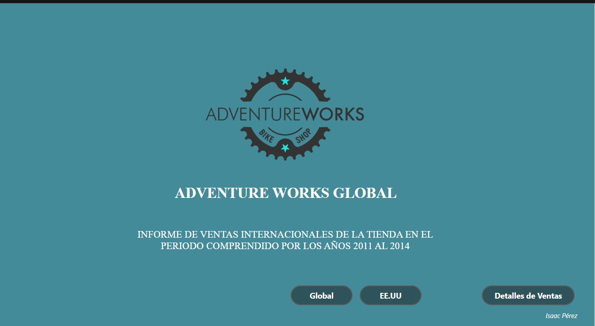
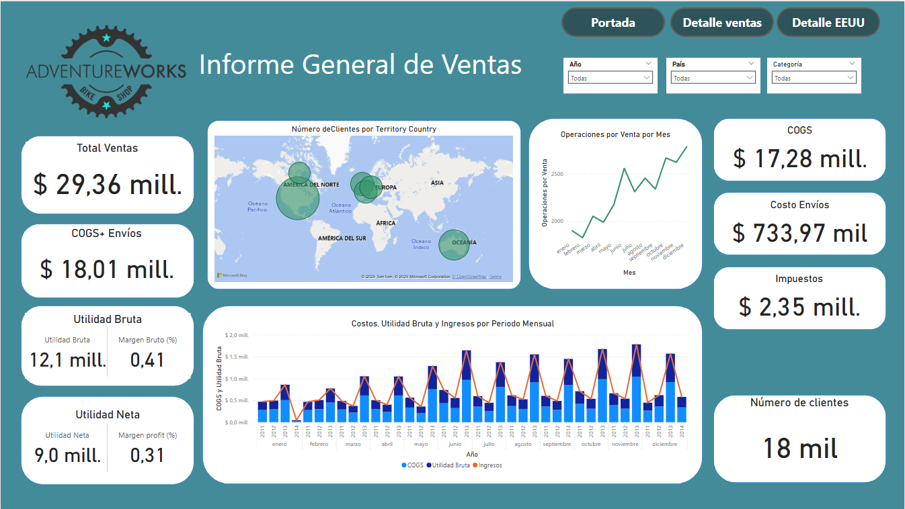
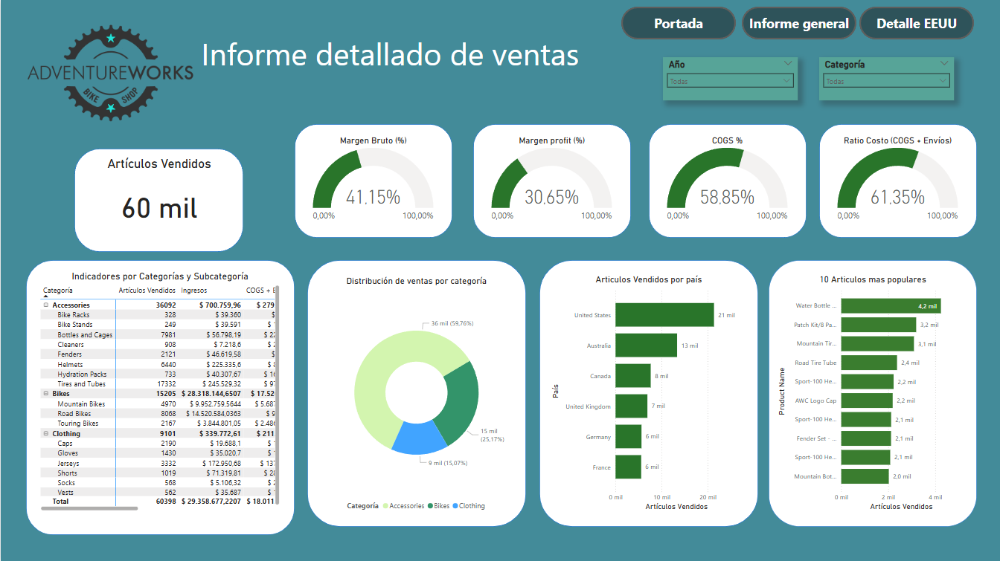
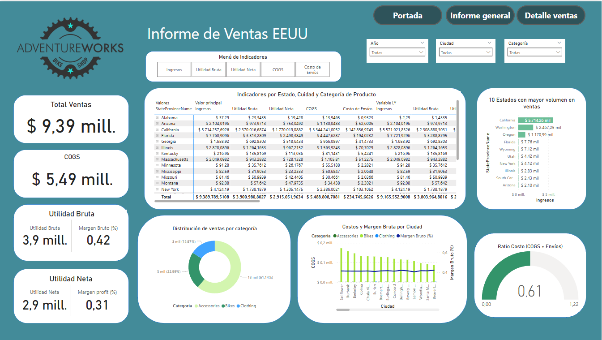

# 📊 Informe Analítico de Ventas para AdventureWorks: Transformación y Visualización de Datos con Power BI

**Autor:** Isaac Manuel Pérez Cuadrado  
**Email:** imperez@correo.unicordoba.edu.co  
**Fecha:** 21/05/2025  

---

## 🎯 Objetivo del Proyecto

AdventureWorks Global es una empresa multinacional del sector ciclismo. El objetivo de este análisis es transformar datos históricos de ventas internacionales (2011–2014) en decisiones estratégicas, optimizando el rendimiento y detectando oportunidades de mejora.

---

## 🛠 Tecnologías Utilizadas

- **SQL Server**
- **Power BI**
- **Power Query**
- **DAX**
- **Git & GitHub**
- **Git LFS**

---

## ⚙️ Proceso del Análisis

### 1. Carga y Transformación
- Restauración de base `.bak` en SQL Server.
- Conexión con Power BI.
- Limpieza y combinación de tablas en Power Query.

### 2. Modelado Relacional
- Modelo en estrella con `FactInternetSales` como tabla central.
- Relaciones con: `DimDate`, `DimCustomer`, `DimProduct`, etc.

### 3. Cálculos DAX
- +30 medidas, agrupadas en:
  - Funciones base
  - Funciones de tiempo
  - Variaciones año a año
  - Porcentajes y ratios

---

## 📊 Reporte en Power BI

## 🖼 Visualizaciones del Dashboard

### 🔹 Dashboard General

### 🔹 Análisis por Categoría

### 🔹 Ventas por Territorio

### 🔹 Detalle del Mercado EE.UU.

---

## 🔍 Insights Clave

1. “Road Bikes” y “Mountain Bikes” dominan el portafolio.
2. Costos bien controlados → margen neto promedio del 31%.
3. Alta estacionalidad (picos en julio y diciembre).
4. Oportunidades en Europa y Sudamérica.
5. Accesorios → volumen alto, baja rentabilidad.
6. Más de **18,000 clientes únicos** analizados.

---

## ✅ Recomendaciones

- Reforzar enfoque en bicis de alta demanda.
- Potenciar ventas cruzadas con ropa/accesorios premium.
- Aprovechar estacionalidad en campañas.
- Expandirse en regiones de bajo volumen pero potencial.
- Implementar control mensual de presupuesto vs. desempeño.

---

## 🤔 Reflexión Personal

Este proyecto integrador me permitió aplicar todos los conocimientos del módulo. Aprendí a construir soluciones de BI desde cero, crear modelos relacionales sólidos, escribir medidas DAX efectivas y presentar resultados de forma clara y estratégica.

---

## 📁 Archivos del Repositorio

| Archivo                               | Descripción                            |
|--------------------------------------|----------------------------------------|
| `AdventureWorksDW2019.bak`           | Base de datos (subida con Git LFS)     |
| `ProyectoIntegrador_Isaac_Perez.pbix`| Reporte interactivo en Power BI        |
| Capturas `.png`                      | Visualizaciones del dashboard          |
| `README.md`                          | Documentación general del proyecto     |

---

## 📫 Contacto

**Email:** imperez@correo.unicordoba.edu.co  
**GitHub:** [IsaacManuelPerez](https://github.com/IsaacManuelPerez)
---
